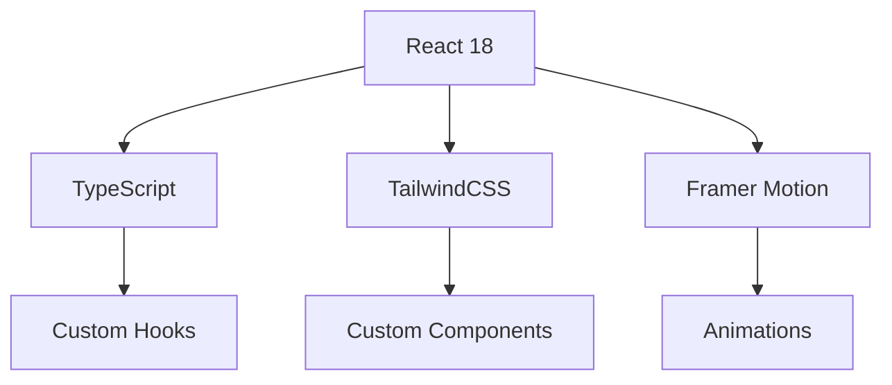
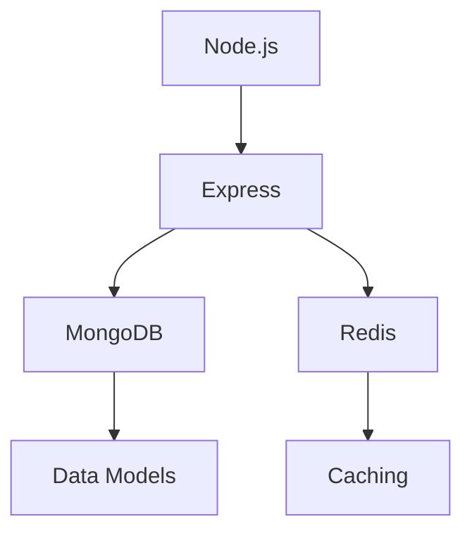

# <div align="center">
  
</div>

<div align="center">

[](https://codestream.com)
[](https://reactjs.org)
[](https://tailwindcss.com)
[](https://www.framer.com/motion)
[](https://www.typescriptlang.org)

[](LICENSE)
[](CONTRIBUTING.md)
[](https://discord.gg/codestream)
[](https://twitter.com/codestream)

[](https://github.com/yourusername/codestream/stargazers)
[](https://github.com/yourusername/codestream/network/members)
[](https://github.com/yourusername/codestream/issues)

</div>

## 📊 Project Statistics

<div align="center">
  
  
</div>

## 🎯 Core Features

<details>
<summary><b>🎨 Advanced UI/UX Features</b></summary>

### Glass-morphism Design
- Sophisticated glass effect components
- Dynamic backdrop blur effects
- Smooth transparency transitions
- Responsive design patterns
- Custom scrollbar styling

### Animation System
- Framer Motion integration
- Page transition effects
- Micro-interactions
- Loading states
- Hover animations
- Scroll-triggered animations

### Theme System
- Dynamic theme switching
- Custom color schemes
- Dark/Light mode
- High contrast mode
- Custom font scaling
</details>

<details>
<summary><b>🏆 Achievement System</b></summary>

### Achievement Categories
- 🥇 Problem Solving
- 🎯 Learning Milestones
- 🌟 Community Contributions
- 🏅 Special Events
- 📚 Course Completion

### Progress Tracking
- Real-time progress updates
- Visual progress indicators
- Milestone celebrations
- Achievement sharing
- Progress analytics
</details>

<details>
<summary><b>📚 Learning Features</b></summary>

### Learning Paths
- Custom learning tracks
- Skill tree visualization
- Progress tracking
- Resource management
- Interactive tutorials

### Code Snippets
- Syntax highlighting
- Code sharing
- Version control
- Tagging system
- Search functionality
</details>

## 🛠️ Technology Stack

### Frontend


### Backend


## 🚀 Getting Started

### Prerequisites
- Node.js (v16+)
- npm or yarn
- Git
- MongoDB
- Redis

### Quick Start
```bash
# Clone the repository
git clone https://github.com/yourusername/codestream.git

# Navigate to project directory
cd codestream

# Install dependencies
npm install

# Start development server
npm run dev
```

## ✨ Feature Showcase

### 🎭 Interactive UI Components
<div align="center">
  
</div>

### 🎮 Animation Showcase
<div align="center">
  
</div>

### 📊 Data Visualization
<div align="center">
  
</div>

## 📁 Project Structure

```
codestream/
├── frontend/
│   ├── src/
│   │   ├── components/
│   │   │   ├── common/
│   │   │   ├── layout/
│   │   │   └── features/
│   │   ├── hooks/
│   │   ├── context/
│   │   ├── pages/
│   │   ├── styles/
│   │   ├── utils/
│   │   └── types/
│   ├── public/
│   └── package.json
├── backend/
│   ├── src/
│   │   ├── controllers/
│   │   ├── models/
│   │   ├── routes/
│   │   ├── services/
│   │   └── utils/
│   ├── config/
│   └── package.json
└── README.md
```

## 🔧 Development Workflow

### Code Style
- ESLint configuration
- Prettier formatting
- TypeScript strict mode
- Husky pre-commit hooks
- Conventional commits

### Testing
```bash
# Run unit tests
npm run test

# Run integration tests
npm run test:integration

# Run e2e tests
npm run test:e2e
```

### Building
```bash
# Build frontend
npm run build

# Build backend
npm run build:server

# Production deployment
npm run deploy
```

## 📈 Performance Optimization

### Frontend
- Code splitting
- Lazy loading
- Image optimization
- Caching strategies
- Bundle analysis

### Backend
- Query optimization
- Caching layers
- Rate limiting
- Load balancing
- Database indexing

## 🔒 Security Features

### Authentication
- JWT-based auth
- OAuth2 integration
- 2FA support
- Session management
- Password policies

### Data Protection
- Input validation
- XSS prevention
- CSRF protection
- Rate limiting
- Data encryption

## 🤝 Contributing

We welcome contributions! Please see our [Contributing Guide](CONTRIBUTING.md) for details.

1. Fork the repository
2. Create your feature branch (`git checkout -b feature/AmazingFeature`)
3. Commit your changes (`git commit -m 'Add some AmazingFeature'`)
4. Push to the branch (`git push origin feature/AmazingFeature`)
5. Open a Pull Request

### Pull Request Process
1. Update the README.md with details of changes
2. Update the documentation
3. Add tests for new features
4. Ensure all tests pass
5. Update the version number

## 📝 License

This project is licensed under the MIT License - see the [LICENSE](LICENSE) file for details.

## 🙏 Acknowledgments

- [React](https://reactjs.org/)
- [TailwindCSS](https://tailwindcss.com/)
- [Framer Motion](https://www.framer.com/motion/)
- [TypeScript](https://www.typescriptlang.org/)
- [MongoDB](https://www.mongodb.com/)
- [Redis](https://redis.io/)

## 📞 Support

- 📧 Email: support@codestream.com
- 💬 Discord: [Join our community](https://discord.gg/codestream)
- 🐦 Twitter: [@codestream](https://twitter.com/codestream)
- 📝 Documentation: [Read the docs](https://docs.codestream.com)

---

<div align="center">
  
</div> 